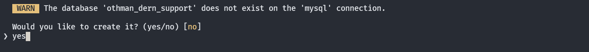
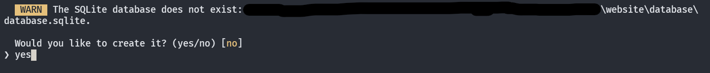

# How to run the project:

## install backend dependencies

```bash
composer install
```

## prepare the database

**with MySQL:**

create `.env` file if you don't have it

create MySQL database called `othman_dern_support`

add the following into you `.env` file:

```
DB_CONNECTION=mysql
DB_HOST=127.0.0.1
DB_PORT=3306
DB_DATABASE=Othman_Dern_Support
DB_USERNAME=root
DB_PASSWORD=
```

**with SQLite:**

create `.env` file if you don't have it

add the following into you `.env` file:

```
DB_CONNECTION=sqlite
```

remove/comment the following from your `.env` file if founded:

```.env
DB_HOST=
DB_PORT=
DB_DATABASE=
DB_USERNAME=
DB_PASSWORD=
```

### run the migrations

```bash
php artisan migrate
```

_if prompted with one of the following just choose `yes` :_





### seed the database with data

```bash
php artisan db:seed
```

### install and run frontend dependencies

```bash
npm run serve
```

### serve the application:

```bash
php artisan serve
```

## Admin routes:

`http://localhost:8000/admin/login`

## Admin account:

**email**: `root@mail.com`
**password**: `root1234`

## User routes:

`http://localhost:8000/register`
